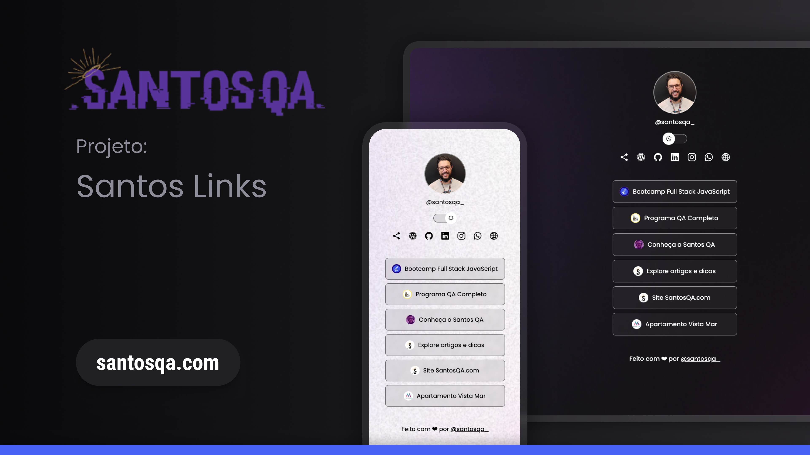
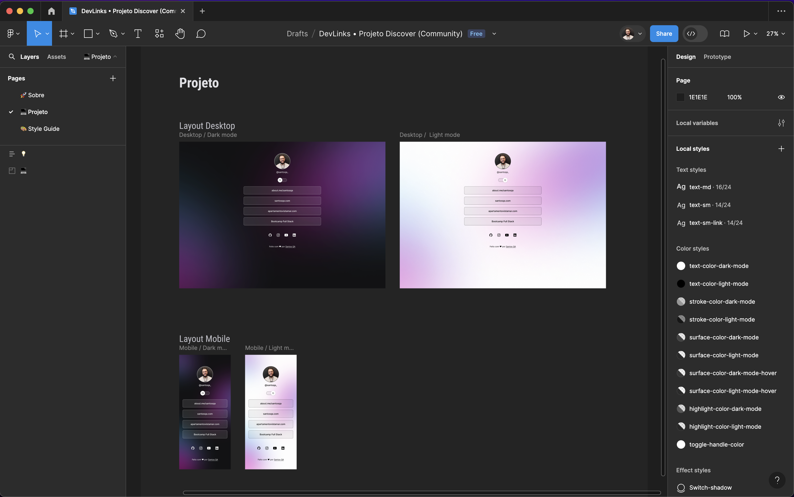

# Santos Links
 
 [](https://santosqa.github.io)  [](https://about.me/santosqa) [](https://github.com/santosqa) [](https://www.linkedin.com/in/santosqa) [](https://www.instagram.com/santosqa_/) [](https://santosqa.com/)


## 💻 Projeto

O projeto [Santos Links](https://santosqa.github.io) é um inovador agregador de links, ideal como seu cartão de visitas online. Desenvolvido com ênfase em acessibilidade e nas melhores práticas, ele permite reunir todos os seus perfis de redes sociais, portfólios e outras informações importantes em um único lugar. Com uma interface amigável e personalizável, o Santos Links facilita a conexão e a interação com seu público, tornando suas informações facilmente acessíveis de qualquer dispositivo.

É a solução perfeita para profissionais que desejam apresentar sua presença digital de maneira elegante e eficiente. Além disso, o projeto implementa testes automatizados de acessibilidade e funcionalidade utilizando o Cypress, um poderoso framework de testes de interface do usuário. Estes testes são executados em uma pipeline de CI/CD configurada no GitHub Actions, garantindo que o código seja testado antes da implantação no servidor.

- [Acesse o projeto finalizado, online](https://santosqa.github.io) 


<p align="center">
  
</p>


##
## 🔖 Layout

Você pode visualizar o layout do projeto através [DESSE LINK NO FIGMA](https://www.figma.com/design/hRq3cweRqfEqXvPUp0dc6n/SantosLinks-%E2%80%A2?m=dev&node-id=10-620). 

<p align="center">
  
</p>

##
## 🚀 Tecnologias


##
## ⚙️ Instalação

Para executar este projeto é necessário ter instalado o [Vscode](https://code.visualstudio.com/download) com as seguintes extensões:

- [Live Server](https://marketplace.visualstudio.com/items?itemName=ritwickdey.LiveServer)
- [Omni Theme](https://marketplace.visualstudio.com/items?itemName=rocketseat.theme-omni)
- [Prettier - Code formatter](https://marketplace.visualstudio.com/items?itemName=esbenp.prettier-vscode)
- [Material Icon Theme](https://marketplace.visualstudio.com/items?itemName=PKief.material-icon-theme)

##
## 🛠️ Configurando o Emmet.variables no VS Code.

1. Abra o vscode.

2. Acesse as configurações do vscode (ctrl + ,).

3. Na barra de pesquisa busque por `emmet`.

4. Na opção `Emmet: Preferences` Clique em `Edit in settings.json`.

5. Adicione as seguintes linhas:

```code
  "emment.variables": {
    "lang": "pt-BR",
    "charset": "utf-8"
  }
```

# Guia de Configuração do Cypress para Testes de Acessibilidade e Funcionais

Este guia fornece um passo a passo para adicionar o Cypress ao seu projeto existente e configurar testes de acessibilidade e testes funcionais.


## Pré-requisitos de Instalação

Antes de começar, certifique-se de que seu ambiente atenda aos seguintes requisitos:


## Passo a Passo

### Passo 1: Inicializar o npm
Se o seu projeto ainda não tiver um arquivo `package.json`, você precisará inicializar o npm.

1. **Abra o terminal na raiz do projeto** (onde estão localizados os arquivos do projeto, como `index.html`, `script.js`, `style.css`, etc...).
2. **Inicialize o npm**:
    ```bash
    npm init -y
    ```
   
### Passo 2: Instalar o Cypress
1. **Instale o Cypress** usando npm:
    ```bash
    npm install cypress --save-dev
    ```

### Passo 3: Inicializar o Cypress
1. Após a instalação, inicialize o Cypress:
    ```bash
    npx cypress open
    ```
   Isso abrirá a interface gráfica do Cypress, siga os passos para criar a estrutura de diretórios `cypress` no projeto.

### Passo 4: Configurar Estrutura de Testes
1. **Verifique a estrutura do diretório Cypress criado**. Ela geralmente se parece com isso:
    ```
    cypress/
        fixtures/
        integration/
        plugins/
        support/
    cypress.config.json
    ```

### Passo 5: Instalar Plugins para Acessibilidade
1. **Instale o `cypress-axe` e `axe-core`** para testes de acessibilidade:
    ```bash
    npm i cypress-axe axe-core -D
    ```
2. **Configure o `cypress-axe`** em `cypress/support/e2e.js`:
    ```javascript
    // Arquivo supports/e2e.js

    import './commands'

    // Adicione as linhas
    import 'cypress-axe'
    import 'axe-core'
    ```

### Passo 6: Criar Testes de Acessibilidade e Funcionais
1. **Crie um arquivo de teste acessibilidade** em `cypress/e2e/accessibility/homepage.a11y.cy.js`:
    ```javascript

    describe('Testes de Acessibilidade', () => {
      beforeEach(() => {
        cy.visit('https://santosqa.github.io/'); // Substitua pelo caminho correto do seu arquivo HTML
      });

      it('Verifica se os elementos têm atributos de acessibilidade adequados', () => {
        // Verifica se o título principal está presente, visível e tem o texto correto
        cy.get('h1.visually-hidden').should('exist').should('be.visible').and('have.text', 'Links Santos QA');

        // Verifica se o botão de alternar tema possui um atributo aria-label
        cy.get('#switch button').should('have.attr', 'aria-label', 'Alternar tema');

        // Verifica se os links sociais possuem atributo aria-label
        cy.get('#social-links a').each(($link) => {
          cy.wrap($link).should('have.attr', 'aria-label');
        });

        // Verifica se as imagens têm atributo alt
        cy.get('img').each(($img) => {
          cy.wrap($img).should('have.attr', 'alt');
        });

        // Verifica se os botões dentro do modal de compartilhamento têm atributo aria-label ou texto acessível
        cy.get('#share-modal button.close-button').should('have.attr', 'aria-label', 'Fechar modal');

        // Verifica se os links de compartilhamento dentro do modal possuem atributo aria-label
        cy.get('#fallback-share-options a').each(($link) => {
          cy.wrap($link).should('have.attr', 'aria-label');
        });

        // Verifica se os links da lista de redes sociais têm atributo aria-label
        cy.get('#links-list a').each(($link) => {
          cy.wrap($link).should('have.attr', 'aria-label');
        });
      });

      
    });

    ```
2. **Crie um arquivo de teste funcional** em `cypress/e2e/functional/homepage.cy.js`:
    ```javascript
        
    describe('Testes Funcionais da Página', () => {
      beforeEach(() => {
        cy.visit('https://santosqa.github.io/'); // Atualize com o caminho correto do seu arquivo HTML
      });

      it('Verifica o título da página', () => {
        cy.title().should('eq', 'Links Santos QA');
      });

      it('Verifica se o texto "@santosqa_" está presente na página', () => {
        cy.contains('@santosqa_').should('exist');
      });

      it('Verifica se todas as fotos de perfil estão carregadas', () => {
        cy.get('#profile img').should('be.visible');
      });

      it('Verifica o funcionamento do botão de alternar tema', () => {
        // Testa se o tema inicial é "dark"
        cy.get('html').should('have.class', 'dark');

        // Clica no botão de alternar tema
        cy.get('#switch button').click();

        // Testa se o tema foi alterado para "light"
        cy.get('html').should('have.class', 'light');
      });
    });
    

    ```

### Passo 7: Executar os Testes 
1. **Execute os testes do Cypress**:
    ```bash
    npx cypress run
    ```


- 

## Links uteis

- [Materiais complementares](https://efficient-sloth-d85.notion.site/Materiais-complementares-d7841615addc4269ba5c5bba12a6edbe)

- [CSS Tricks](https://css-tricks.com/)

- [Google Fonts - poppins](https://fonts.google.com/specimen/Poppins)

- [Can I Use](https://caniuse.com/)

- [Ionicons](https://ionic.io/ionicons)

- [Node.js](https://nodejs.org/)

- [npm](https://www.npmjs.com/)

- [Cypress](https://www.cypress.io/)

- [cypress-axe](https://github.com/component-driven/cypress-axe)

- [axe-core](https://github.com/dequelabs/axe-core)

- [mochawesome](https://www.npmjs.com/package/mochawesome)


#
---

Feito com ♥ por Ricardo Santos QA :wave: [about.me/santosqa](https://about.me/santosqa)


<p align="center">
  
</p>
